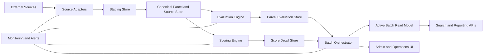
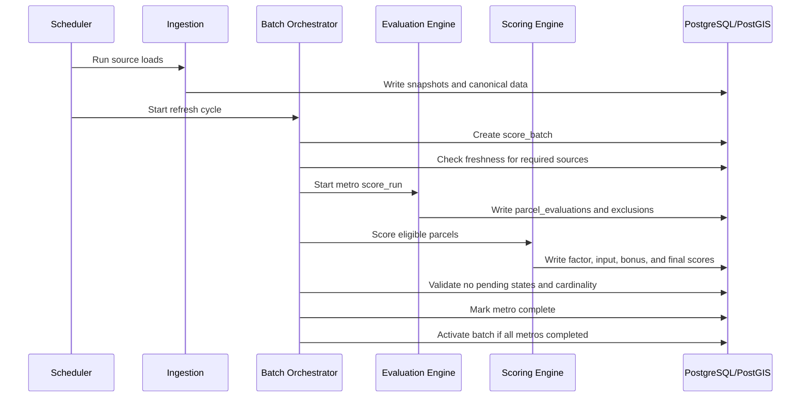

# KIO Site Finder Phase 1 Software Architecture Document

## 1. Architecture Goals

The Phase 1 architecture is designed to satisfy five goals:

1. publish only complete, activated batches,
2. block scoring when required data is stale,
3. preserve full parcel-scoring auditability,
4. align data structures with PostgreSQL/PostGIS capabilities, and
5. isolate legacy ambiguity behind one clear implementation model.

## 2. Context View

## 3. Architectural Style

Phase 1 uses a modular service-oriented backend centered on PostgreSQL/PostGIS. The system is not designed as a microservice sprawl. Instead, it uses a small number of cohesive services with clear ownership boundaries:

- ingestion services,
- evaluation/scoring services,
- orchestration services,
- read/reporting services,
- admin/operations services.

This keeps operational complexity low while still allowing independent testing and deployment.

## 4. Logical Components

### 4.1 Source Adapters

Responsibilities:

- ingest approved parcel, zoning, utility, environmental, and market-supporting sources,
- validate format and required fields,
- write snapshot metadata,
- quarantine bad loads.

### 4.2 Canonical Data Store

Responsibilities:

- persist normalized parcel and supporting datasets,
- store source catalog and snapshot metadata,
- persist representative-point geometry,
- support query-aligned partitioning and indexing.

### 4.3 Evaluation Engine

Responsibilities:

- create metro-scoped score runs,
- evaluate every parcel in scope,
- apply band, size, and exclusion rules,
- write parcel statuses and exclusion events.

### 4.4 Scoring Engine

Responsibilities:

- compute factor details, factor inputs, bonus details, scores, and confidence,
- enforce direct-evidence precedence,
- enforce cardinality and completion invariants,
- support deterministic reruns.

### 4.5 Batch Orchestrator

Responsibilities:

- create one system-wide batch per refresh cycle,
- coordinate metro runs,
- evaluate completion conditions,
- activate the batch only after all required metros succeed.

### 4.6 Active Read Model

Responsibilities:

- expose only the latest activated batch,
- support search, parcel detail, and export queries,
- isolate user-facing reads from in-flight batch construction.

### 4.7 Admin and Operations UI

Responsibilities:

- display source freshness, run progress, failures, and batch history,
- support retry/cancel/rerun actions,
- expose audit-ready operational context.

## 5. Deployment View

Recommended deployment shape for Phase 1:

- one PostgreSQL/PostGIS cluster,
- one application runtime for APIs/admin,
- one background worker runtime for ingestion/evaluation/scoring jobs,
- one scheduler/orchestrator runtime,
- centralized logging and metrics collection.

The application layer may be deployed as containers or managed services, but the design assumes stateless workers with database-backed job state.

## 6. Data Architecture

### 6.1 Key Principles

- Normalize business rules that require validation or closed sets.
- Persist derived geospatial artifacts used repeatedly in predicates.
- Partition data according to real query filters.
- Treat batch activation as a publication event, not as a side effect of one metro finishing.

### 6.2 Core Stores

- `source_catalog`, `source_interface`, `source_snapshot`
- `metro_catalog`, `county_catalog`
- `raw_parcels`, `parcel_rep_point`
- `score_batch`, `score_run`
- `parcel_evaluations`, `parcel_exclusion_events`
- `scoring_profile`, `scoring_profile_factor`
- `factor_catalog`, `bonus_catalog`
- `score_factor_detail`, `score_factor_input`, `score_bonus_detail`
- active-batch-backed read views/materialized views

## 7. Runtime Flow

## 8. Key Architectural Decisions

### 8.1 Remove `candidate_parcels_v`

Decision:

- candidate sets are derived from `parcel_evaluations` within a specific run, not from a global view.

Rationale:

- removes contradictory object definitions,
- makes run scope explicit,
- improves auditability and reproducibility.

### 8.2 Use Normalized Scoring Profile Factors

Decision:

- replace JSONB sum validation with `scoring_profile_factor`.

Rationale:

- avoids invalid PostgreSQL `CHECK` constructs,
- supports factor closure and versioning,
- simplifies auditing of point allocations.

### 8.3 Use Active Batch Publication

Decision:

- user-facing reads resolve through the latest activated batch only.

Rationale:

- prevents mixed old/new metro states,
- allows failed or partial refreshes without exposing unstable data.

### 8.4 Persist Representative Point

Decision:

- store `rep_point` at ingestion and index it.

Rationale:

- ensures consistent geospatial semantics,
- reduces repeated computational overhead,
- matches the requirement to avoid centroid ambiguity.

## 9. Cross-Cutting Concerns

### 9.1 Security

- enterprise authentication,
- role-based access control,
- service-to-service authentication for jobs,
- audit log for operator actions.

### 9.2 Observability

- pipeline stage metrics,
- freshness and source health metrics,
- structured logs for every run and batch,
- alerts for stale data, failed runs, and activation failures.

### 9.3 Reliability

- idempotent reruns,
- duplicate-safe provenance writes,
- transaction boundaries around stage completion,
- rollback to prior active batch when validation fails pre-activation.

## 10. Risks and Architectural Guardrails

| Risk | Guardrail |
| --- | --- |
| Stale critical sources | Freshness gate before score writes |
| Query-performance regressions | Query-aligned partitioning and index review |
| Ambiguous business logic | Factor and bonus catalogs versioned and governed |
| Partial publication | Active-batch-only read model |
| Retry duplication | Unique constraints plus upsert logic |

## 11. Architecture Compliance Criteria

The architecture is compliant when:

- all source-triggered runs use freshness validation,
- no UI/API query bypasses the active batch,
- all parcel scoring is explainable through factor and provenance records,
- all repeated geospatial predicates use persisted representative points,
- the deprecated candidate view is absent from the delivered system.
