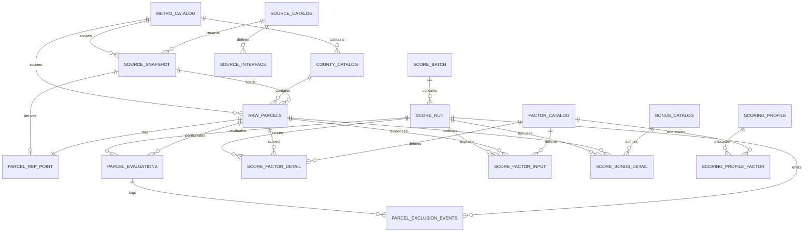

# Phase 2 ERD

```mermaid
erDiagram
    METRO_CATALOG ||--o{ COUNTY_CATALOG : contains
    METRO_CATALOG ||--o{ SOURCE_SNAPSHOT : scopes
    METRO_CATALOG ||--o{ RAW_PARCELS : scopes
    SOURCE_CATALOG ||--o{ SOURCE_INTERFACE : defines
    SOURCE_CATALOG ||--o{ SOURCE_SNAPSHOT : records
    COUNTY_CATALOG ||--o{ RAW_PARCELS : contains
    SOURCE_SNAPSHOT ||--o{ RAW_PARCELS : loads
    SOURCE_SNAPSHOT ||--o| PARCEL_REP_POINT : derives
    RAW_PARCELS ||--|| PARCEL_REP_POINT : has
    SCORE_BATCH ||--o{ SCORE_RUN : contains
    SCORE_RUN ||--o{ PARCEL_EVALUATIONS : evaluates
    RAW_PARCELS ||--o{ PARCEL_EVALUATIONS : participates
    PARCEL_EVALUATIONS ||--o{ PARCEL_EXCLUSION_EVENTS : logs
    SCORE_RUN ||--o{ PARCEL_EXCLUSION_EVENTS : emits
    SCORE_RUN ||--o{ SCORE_FACTOR_DETAIL : scores
    SCORE_RUN ||--o{ SCORE_FACTOR_INPUT : explains
    SCORE_RUN ||--o{ SCORE_BONUS_DETAIL : bonuses
    RAW_PARCELS ||--o{ SCORE_FACTOR_DETAIL : scored
    RAW_PARCELS ||--o{ SCORE_FACTOR_INPUT : evidences
    RAW_PARCELS ||--o{ SCORE_BONUS_DETAIL : bonuses
    FACTOR_CATALOG ||--o{ SCORE_FACTOR_DETAIL : defines
    FACTOR_CATALOG ||--o{ SCORE_FACTOR_INPUT : defines
    BONUS_CATALOG ||--o{ SCORE_BONUS_DETAIL : defines
    SCORING_PROFILE ||--o{ SCORING_PROFILE_FACTOR : allocates
    FACTOR_CATALOG ||--o{ SCORING_PROFILE_FACTOR : references
```

